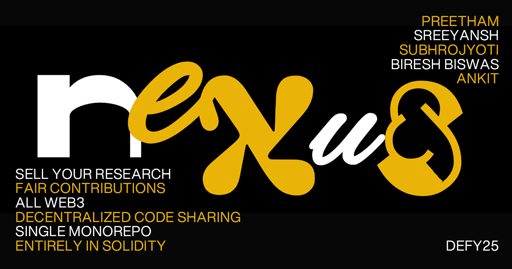

## Nexus Research DAO

Collaborate Securely, Own Completely, Profit Fairly

### About Nexus
We built a Research DAO that changes how people collaborate on research. It’s simple, secure, and fair.

In our platform, anyone can contribute to research without fear of being exposed, sabotaged, or having their ideas stolen. A monorepo keeps everything organized and tracks contributions transparently, while identities stay private.

When the research is complete, it’s turned into an NFT—a digital badge of ownership. Contributors get credit and can sell their work or earn from it, all without middlemen.

We’ve created a space where research is open, safe, and rewarding. A world where ideas thrive, and the people behind them get what they deserve.

Join us and be part of the future of research. 

### Technology Stack:
Frontend:
- NEXT.js
- Tailwind CSS
- GSAP
- Three.js
- Locomotive-scroll
- Luicide
- Lenis

Web3 and Backend:
- SandBox
- Docker
- Solidity
- Hardhat
- Ethers.js
- IPFS
- Remix IDE
- Pinata

### Team:
- [Ankit Prasad](https://www.github.com/ankitprasad2005)
- [Preetham Pemmasani](https://www.github.com/ppmpreetham)
- [Biresh Biswas](https://www.github.com/Billa05)
- [Sreeyansh Dhenevahi](https://www.github.com/sreeyanshyolo262)
- [Subhrojyoti Sen](https://www.github.com/concprog)